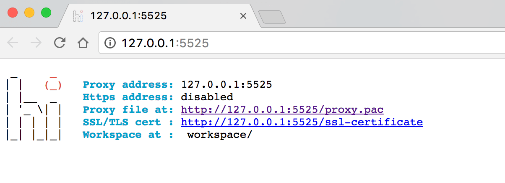
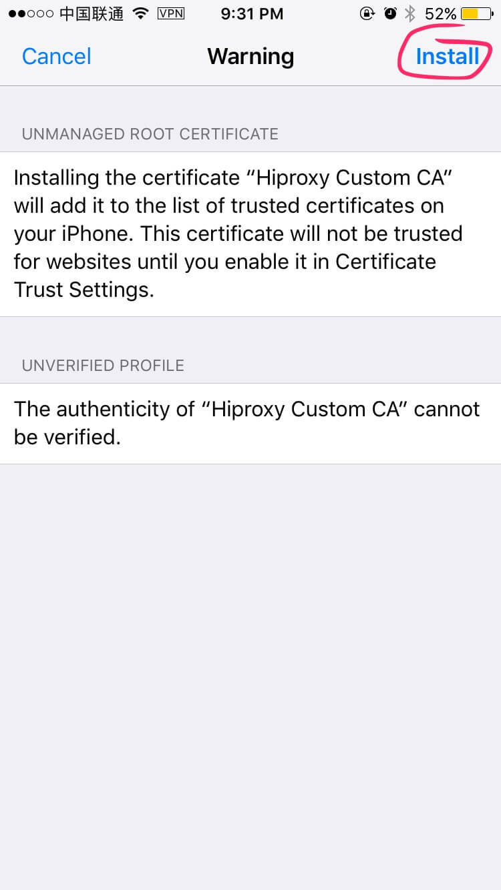
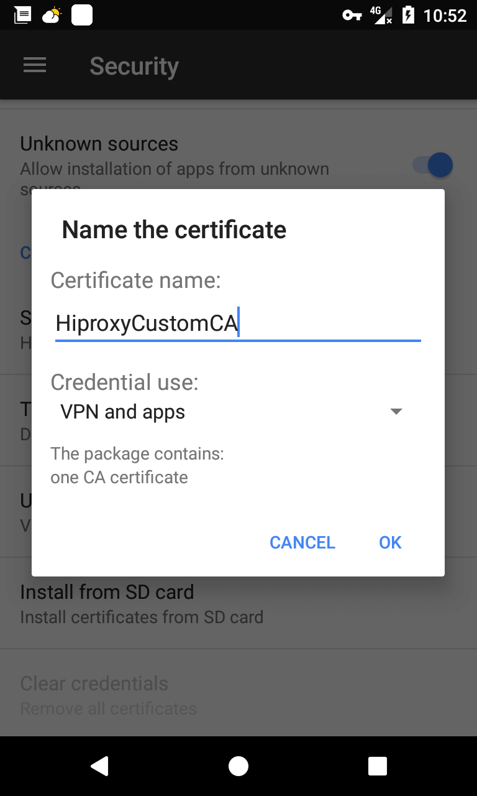

title: Get And Install SSL Certificate
---

> If you are willing to help hiproxy to write documentation, please contact zdying@live.com, thank you!

Hiproxy can generate its own root certificate. You can think it as a CA (Hiproxy Custom CA). If a https request need hiproxy to forward, hiproxy would use its own root certificate to generate automatically a secure certification of that https request.

Hiproxy own root certificate is not trusted by OS, therefore, you have to install the root certificate by manual to let OS know it as trusted one.

## Download The Certificate

As soon as hiproxy is started (suppose the port number is `5525`), you can go <http://127.0.0.1:5525/ssl-certificate> to get the root certificate of **Hiproxy Custom CA**.

You can get the URL from <http://127.0.0.1:5525/> by following below image:

## Install Certificate

The following describes how the root certificate is installed in OSX, iOS, Windows and Android.

### Mac OSX

1. Double click downloaded `Hiproxy_Custom_CA_Certificate.pem` to import the certificate to keychain.

2. Input your username and password in popuped dialog.

3. Now the certificate is not trusted. You should double click the certificate which is imported in previous step.

4. Choose ** Always trust** by following **Trust** > **While using this certificate**.

5. Close the dialog. Now the certificate is in trusted state.

### iOS

1. Send the downloaded certificate to iPhone then open it in iOS.

2. Click **Install** on the top right of the view.

3. Click **Install** to confirm.

4. After complate installing, click **Complete** to finish and exit installing.

5. If the **iOS version &gt;= 10.3**, you have to click **Certificate trust settings** by following **Settings** &gt; **General** &gt; **About this iPhone**.

6. Open the switcher on **Hiproxy Custom CA**.

### Windows

1. Double click downloaded  `Hiproxy_Custom_CA_Certificate.crt` to install the certificate.

2. Click **Install certificate** on the popuped dialog.

3. Click **Next**.

4. Choose **Persist all certificates in below storage(P)** then click **Browse(R)** and select **Trusted CA**, click **OK**

5. Click **Next**, then **Finish**. Complete the certificate installing by following wizard.

### Android

1. Download the certificate and send it to mobile.

2. Click **Install from SD card** by following **Settings** &gt; **Security**.

3. Input the unlock password then certificate name, for example **HiproxyCustomCA**, then click **OK**.

4. Follow **Settings** &gt; **Security** &gt; **Trusted certificate** &gt; **Users**. If you can find hiproxy root certificate, it succeeds.

